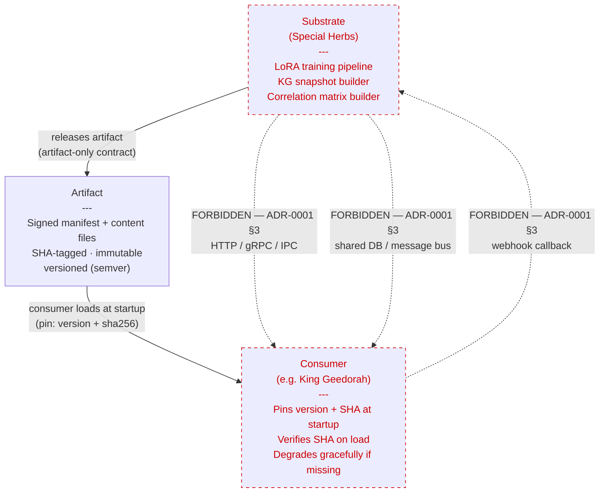

# Special Herbs

> *"The Special Herbs and Spices Series"* — MF Doom (Metal Fingers), 2003-2007. Ten volumes of instrumental beat tapes that other artists rapped over.

Research substrate that produces versioned artifacts (LoRA adapters, knowledge graph snapshots, correlation matrices) consumed by trading systems. **Substrate produces; consumers rap.** Each artifact release is a "volume" — SHA-tagged, immutable, pinned by consumers at startup.

## Status

**Pre-Phase-0.** Repo scaffold only. No code work begins until the consumer system (King Geedorah) clears its Phase 10 settle gate (target 2026-05-10) and Phase 13.1 RLAIF Pipeline Validation lands (~late August 2026). Until then this repo holds design documents and ADRs.

## What this is

A **research substrate** that produces structured market intelligence as versioned artifacts at rest:

- **Area 1 — Agentic Information Synthesis** — LoRA adapters fine-tuned on domain-specific reasoning corpora (FDA briefing docs, SEC filings, governance proposals). Knowledge graph snapshots. Synthesis notes. Mispricing flags.
- **Area 4 — Cross-Domain Signal Networks** — Cross-venue correlation matrices. Divergence event logs. Lead-lag analyses. Cross-asset feature snapshots.

Outputs are **artifacts at rest**, never live services. Consumers load specific SHA-tagged versions at startup; they do not live-fetch.

## What this is NOT

- Not a trading bot. The substrate produces intelligence; trading decisions belong to consumer systems.
- Not a runtime service. Consumers load artifacts independently; no live API coupling.
- Not a child process of any consumer. Independent codebase, independent lifecycle, independent release cadence.
- Not coupled to King Geedorah at runtime. KG is the first consumer; future consumers may emerge; the substrate has no knowledge of which consumers exist.

## Initial consumer

[King Geedorah](https://github.com/jegriffi91/King-Geedorah) — solo retail trading system. KG's Phase 14A FDA-driven equity catalysts and Phase 14E intraday equity microstructure strategies are the planned first consumers of Volume 1.

## Architectural principles (locked)

Three ADRs establish the substrate's binding architectural contract; all three are co-equal foundational law:

- [ADR-0001](docs/architecture/ADR-0001-substrate-as-artifact-contract.md) — substrate-as-artifact contract (eight rules; see below).
- [ADR-0002](docs/architecture/ADR-0002-separate-repo-from-consumers.md) — filesystem-level separation from consumer repos.
- [ADR-0003](docs/architecture/ADR-0003-training-and-schedule-ownership.md) — training pipeline + schedule ownership boundaries.

The eight rules from ADR-0001, briefly:

1. **Versioned and immutable artifacts.** Every artifact carries a SHA-tagged signed manifest; once published, never retroactively edited.
2. **Consumers pin specific versions.** Pin SHA + semver at startup; floating selectors (`latest`, `>=1.0`) are forbidden in production.
3. **No runtime API between substrate and consumers.** No HTTP, gRPC, IPC, webhooks, shared message buses.
4. **No shared databases.** Same upstream source means duplicate ingestion, not shared connection.
5. **Graceful consumer degradation.** Consumers must function (with reduced capability) when artifacts are unavailable, corrupted, or fail SHA verification.
6. **Substrate has no knowledge of consumers.** No consumer names, no consumer-keyed conditionals, no consumer-specific tests in substrate code.
7. **LLM is feature extractor only, never decision-maker.** Substrate emits features; consumers' deterministic scorers decide.
8. **Cross-repo separation enforced at the file system.** Substrate's `pyproject.toml` MUST NOT depend on any consumer codebase; only `special-herbs-formats` is a permitted shared package.

## Architecture

*Artifact-only consumer contract — see [ADR-0001](docs/architecture/ADR-0001-substrate-as-artifact-contract.md) §3 for forbidden runtime couplings.*

## Roadmap

See [docs/ROADMAP.md](docs/ROADMAP.md). High-level:

- **Vol. 0 (Phase 0) — Preconditions.** KG settle gate + KG RLAIF Phase 13.1 validation + 30+ papers read. No code.
- **Vol. 1 (Phase 1) — Area 1 MVA.** One fine-tuned LoRA on a single domain (FDA briefing docs). Loaded into KG's Gateway. Measured for ≥1.5% Brier reduction (Phase 2 escalation gate at ≥3%).
- **Vol. 2 (Phase 2) — Area 4 first artifact.** Conditional on Vol. 1 clearing the gate. Cross-venue correlation matrix.
- **Vol. 3+ (Phase 3) — Depth.** Conditional. More domains, more adapters, broader correlation coverage.

Each volume drops only when the prior volume clears its measurement gate. Stagnation → kill that area.

## License

TBD. Likely permissive (MIT/Apache-2.0) for the architectural primitives, with private artifact contents (LoRA weights, KG data) excluded from open release.

## Related

- Sister repo: [King Geedorah](https://github.com/jegriffi91/King-Geedorah) — the initial consumer.
- Source synthesis that produced this scaffold: `~/.claude/research_logs/2026-04-28_112632_kg-moat-substrate-selection/`.
- Naming metaphor: [Special Herbs (Wikipedia)](https://en.wikipedia.org/wiki/Special_Herbs).
